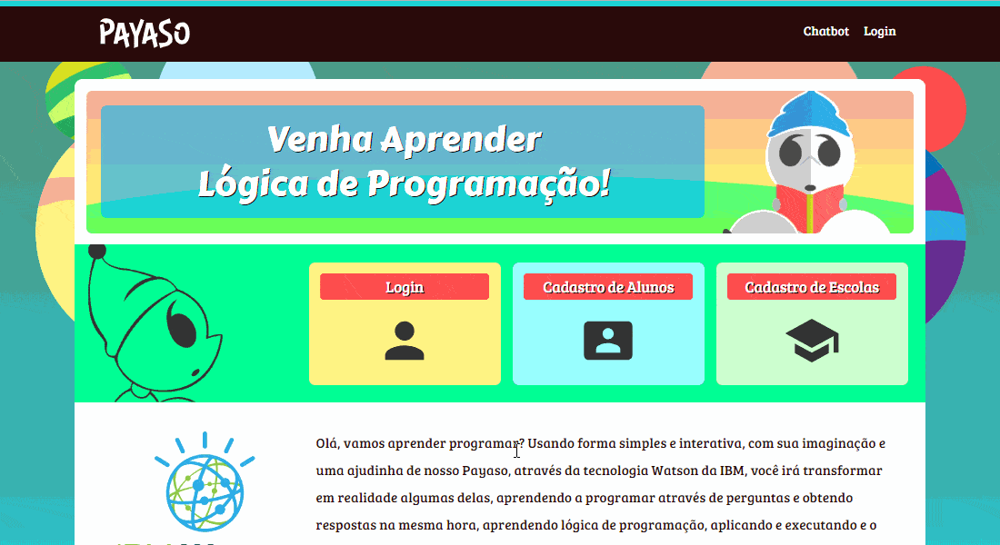

# Projeto Payaso / Payaso Project :star2: :hear_no_evil: :zap:

## Sobre
Este é o projeto feito pelos alunos _**Matheus**_, _**Thiago**_, _**Pedro**_ e _**Alexandre**_ para a AM(Avaliação Multidisciplinar) 2018 do primeiro ano de graduação do curso de Análise e Desenvolvimento de Sistemas da FIAP.
O objetivo era a idealização e desenvolvimento de um projeto integrado com o ChatBot da IBM(Watson Conversation). Para isso deveríamos utilizar as tecnologias aprendidas durante o curso(JAVA, JSP, Servlets, SQL, HTML, CSS, JavaScript) e fornecer o **CRUD implementado e funcionando**.
## About
This is a project made by the students  _**Matheus**_, _**Thiago**_, _**Pedro**_ e _**Alexandre**_ for the 2018 Multidisciplinary Assignment of the first year of Systems Analysis and Development Graduation at FIAP College.
The goal was to design and develop an integrated project with the IBM ChatBot (Watson Conversation). For this we should use the technologies learned during the course (JAVA, JSP, Servlets, SQL, HTML, CSS, JavaScript) and provide the **CRUD - up and running**.

### Funcionalidades / Functionalities:
#### Login
- Login para usuários cadastrados
- Cadastro de nova escola
- Cadastro de novo usuário
#### Login
- Login for registered users
- New School Registration
- New User Registration

#### Perfil de Aluno
- Alunos possuem página de perfil
- Pontuação acumulada
- Lista das mensagens
- Medalhas caso tenha a pontuação necessária
- Nome, descrição, avatar, nome da escola
- Usuário pode editar o seu perfil
#### Student Profile
- Students have a profile page
- Accumulated score
- Message list
- Badges by score
- Name, description, avatar, school's name
- User can edit your own profile

#### Perfil de escola
- Escolas possuem página de perfil
- Nome, descrição, avatar
- Total de alunos cadastrados
- Total de pontos acumulados de todos os alunos da escola
- Medalhas caso tenha a pontuação necessária
- Alunos em destaque, os 4 alunos com maior pontuação
- Lista de mensagens
#### School Profile
- Schools have a profile page
- Name, description, avatar
- Total of registered students
- Total accumulated points from all students of the school
- Badges by score
- Students showcase - the 4 students with the highest scores
- Message List

#### Sistema de mensagens
- Usuários logados podem postar mensagens em perfis de Escolas
- Usuários logados podem postar mensagens em perfis de Alunos
#### Messaging system
- Logged-In Users can post messages in the School Profiles
- Logged-In Users can post messages in the Student Profiles

#### Outros
- Ranking com a lista ordenada das escolas que tenham acima de 0 pontos
- Sistema de Admin
- Os dados e informações, são todos buscados no banco e renderizados apropriadamente
#### Misc
- Ranking with an ordered list of schools that have above 0 points
- Admin System
- The data and information are all fetched in the database and rendered appropriately
